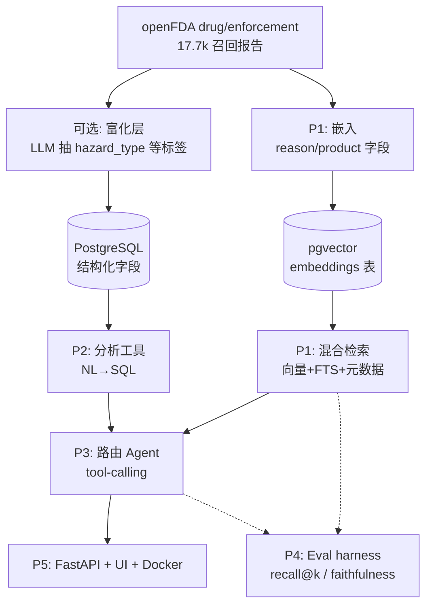

# FDAgent — openFDA 药品召回智能体 · 开发计划 (v3)

> **数据集：openFDA `drug/enforcement`**（美国 FDA 药品召回执法报告，100% 公开、无 PII）。
> 这是一个**完全公开**的作品集项目：数据与代码均可上网，不涉任何专有/公司内部内容。
> 背景：openFDA 数据已是**半结构化**（FDA 模板给了粗粒度字段），工作重心放在 JD 真正考察的四块：**检索质量 / Agent / 评估 / 部署**。
> 目标岗位信号：RAG、向量检索、Agentic tool-use、Evaluation、LLM 工程化、部署。
> **实时状态以 [PROGRESS.md](PROGRESS.md) 为准**；本文是稳定路线图 + 选型。
> 最后更新：2026-06-26

---

## 0. 数据现状校准（决定了计划怎么走）

| 维度 | 现状 | 含义 |
| --- | --- | --- |
| 结构化程度 | FDA 给了 `classification`(I/II/III)、`status`、`product_type`、`recalling_firm`、`state`、各类日期 | **粗粒度已有**，可直接做过滤/聚合（Tier-A 硬字段） |
| 自由文本 | `reason_for_recall`（为什么召回）、`product_description`（什么产品）——较短（p95 ~300 字符） | 语义检索的主目标；短文本**不用切块** |
| 规模 | `drug_enforcement` 17,723 条（单文件可下载） | 右尺寸：够有说服力，又能本地全量跑 |
| 母公司层级 | 库里没有；`recalling_firm` 名碎片化（1,634 个） | 实体解析是 Phase 3 的核心难点 |

**结论**：数据已半结构化，不做重型清洗。直接做 **确定性聚合（Path 1）+ 语义/混合检索（Path 2）+ Agent + 评估 + 部署**。

---

## 1. 总体架构

**一句话数据流**：openFDA 文本 →（可选富化）→ 切块入向量库 + 字段入 SQL → 混合检索 + 分析工具 → 路由 Agent 统一调度 → API/UI 暴露 → Eval 全程把关。

---

## 2. 技术选型总表（务实、低成本、可上线）

> 图例：✅ 已落地　🔜 已定·待建

| 层 | 选型 | 备选 | 为什么 |
| --- | --- | --- | --- |
| 语言 | ✅ **Python 3.13** | — | 与你技能一致、生态最全 |
| LLM（NL→QuerySpec / Agent 推理） | ✅ **gpt-4o-mini**（`OPENAI_MODEL` 可调） | gpt-4o / gpt-4.1 / Claude | 受约束 spec 生成够用又便宜；复杂 routing 可临时升级 |
| Embedding | ✅ **text-embedding-3-small**（1536 维） | -3-large / bge-small(本地免费) | 性价比最高；药品文本纯英文够用，~$0.05 |
| 向量库 | ✅ **pgvector**（Postgres 内） | Chroma / FAISS / Qdrant | 一个库搞定结构化 + 向量，无需额外服务 |
| 关键词检索 | 🔜 **Postgres 全文检索（FTS, `ts_rank`）** | pg_search(真 BM25) / rank-bm25 / ES | v1 留在 Postgres、带词干化；FTS 召回不够再上真 BM25 |
| 混合融合 | 🔜 **RRF**（Reciprocal Rank Fusion） | 加权和 | 无需调权重，简单稳健 |
| 重排 / 校验 | 🔜 **LLM 逐条判定 + 证据片段** | bge-reranker / Cohere | 与“逐条校验”层合并；高精度 + 可解释 |
| 结构化数据 | ✅ **PostgreSQL**（Postgres.app 17） | SQLite / DuckDB / Snowflake | 同库承载向量；生产可换 Snowflake |
| 结构化输出 | ✅ **Pydantic v2 + OpenAI structured output** | Instructor 库 | schema 校验、防 LLM 漂移 |
| 重试 / 限流 | **tenacity** | 自写 backoff | 指数退避、稳态批处理 |
| Agent 框架 | 🔜 **OpenAI function calling 原生** | LangGraph（进阶可选） | 先用原生，别一上来上重框架 |
| 实体解析（Phase 3） | 🔜 **pg_trgm 模糊 + 已知子公司展开 + LLM 核验** | fuzzystrmatch / dedupe | firm 名碎片化（1,634 个）；名变体 + 子公司需归并 |
| 评估 | 🔜 **自写 harness + 版本化黄金集** | ragas / promptfoo | 数字来自 SQL → 可精确断言；模糊维度才用 LLM-judge |
| 可观测 / 追踪 | 🔜 **query_log（Postgres, L1）→ Langfuse（L2）** | Phoenix / Helicone / OTel | 每次 /ask 一条 trace，`QuerySpec` 即可审计推理；自建表兼作 eval 数据集 |
| 后端 | ✅ **FastAPI + uvicorn** | Flask | 异步、自动文档、业界标配 |
| 前端 | ✅ **静态 HTML + Chart.js（FastAPI 托管）** | Streamlit / Next.js | 单进程单镜像、零构建步骤 |
| 容器 | ✅ **Docker**（镜像源参数化、密钥运行时注入） | — | 部署一致性、简历必备 |
| 托管（公开部署） | 🔜 **Hugging Face Spaces**（免费） | Render / Fly.io / Railway | 免费挂 live demo |
| 数据库（公开部署） | 🔜 **Supabase / Neon**（自带 pgvector） | RDS | 云容器连不到本机 localhost，需托管库 |

> **省钱模式**：embedding 用本地 `bge-small`，LLM 用本地 `Llama-3.1-8B`（Ollama），全程 0 API 费用。但起步建议用 OpenAI（快、省心），2000 条成本仅几美元（见 §9）。

---

## 3. 分阶段路线（drug-recall 原生；实时状态见 [PROGRESS.md](PROGRESS.md)）

> 把架构落成可交付切片，每片都「可演示 + 带证据（`recall_number`）」。

### Path 1 — 确定性 NL→SQL 分析（✅ 已完成）
自然语言问**频率 / 趋势 / 分布**，每个数字都来自参数化 SQL（绝不让 LLM 编数字）。
- LLM 只产出受约束的 `QuerySpec`（列/值白名单 + schema 注入），再翻成只读、参数化 SQL。
- 安全（OWASP）：只读连接 + 只允许 SELECT + 列名走白名单 + 值走参数绑定（防注入）。
- 落地：`src/analytics.py`（聚合引擎）+ `src/nl_query.py`（NL→QuerySpec）。

### Path 2 — 语义 / 混合检索（🚧 进行中）
答 Path 1 答不了的**模糊概念**问题（「无菌问题」「致癌杂质」「药效太强」）。
- 嵌入 `reason_for_recall` + `product_description` 入 `embeddings`（pgvector）。详见
  [频率查询系统设计](频率查询系统设计-过滤检索校验.md) §9。✅
- 概念走 `semantic_query` → 向量检索（可叠加 Tier-A 硬过滤），不再用字面 `ilike`。✅
- **剩余**：加 Postgres 全文检索（FTS）+ **RRF** 融合（救精确术语，如 NDMA / child-resistant）；
  逐条 LLM 校验 + 语义计数（估计值 + 置信区间）。

### 前端 — ChatGPT 式聊天 UI（🚧 计划中）
对话流 + 左侧会话栏 + 可编辑消息 + 随时停止。模块化静态文件（`index.html` / `app.js` /
`styles.css`），原生 JS、零构建（保持单进程单镜像）。历史存浏览器 `localStorage`、随请求回传给模型做
**对话上下文**——无需数据库、无需账号、不采集任何用户信息（对公开 demo 更安全）。

### 可观测 + 评估（差异化加分）
- **可观测**：每次 `/ask` 落 `query_log`（Postgres，L1）→ 接 **Langfuse**（L2）。`QuerySpec` 即可审计的「推理」。
- **评估**：版本化黄金集；**数字来自 SQL → 可精确断言**（如「无菌」必须走 `semantic_query` 而非 `ilike`）；
  检索 recall@k / MRR；答案忠实度用 LLM-as-judge；标签稳定性用 Cohen's κ。

### Phase 3 — 路由 Agent（tool-calling 资本式整合）
一个 agent 自动在 **语义检索 / 统计分析 / 实体解析** 间路由。杀手级用例：「我买了某药，这家公司安不安全？」
→ 品牌→母公司 `[inferred]` → `recalling_firm` 实体解析（`pg_trgm` 模糊 + 已知子公司展开 + LLM 核验）
→ 复用分析引擎 → 答案**严格区分 [推断] 与 [事实]**、带证据。原生 OpenAI function calling，先不上 LangGraph。

### 部署
FastAPI `/ask` + `/health` + 静态 UI，Docker 打包（镜像源参数化、密钥运行时注入）。
公开上线：推镜像到 HF Spaces / Render + 托管 Postgres（Supabase / Neon，自带 pgvector）。

---

## 4. （可选）轻量富化层 — 展示「分类 + 评估」功力

想在简历上落地「taxonomy 设计 + 分类 + Cohen's κ」就做：用 `gpt-4o-mini` + Pydantic 从
`reason_for_recall` 抽一个**召回原因分类** `hazard_type`（sterility / contamination /
labeling_error / superpotent / foreign_material / …），带 per-field 置信度。
工程点（面试会问）：异步批处理（`asyncio` + `Semaphore`）、`tenacity` 指数退避、checkpoint 续跑、
幂等（按 `recall_number`）、Pydantic 校验失败 → repair 重试 → 死信。**非必需**——纯 Path 2 也能出活。

---

## 5. 成本估算（本数据集，OpenAI 起步价位）

| 项目 | 用量 | 量级 |
| --- | --- | --- |
| 嵌入（text-embedding-3-small） | 35,446 段（reason + product） | ~$0.05 |
| NL→QuerySpec / 检索问答（gpt-4o-mini） | 演示/测试几千次 | ~$1–5 |
| （可选）富化 + LLM-as-judge 评估 | 各几千次 | ~$1–3 |
| **合计** | | **约 $5 上下** |

> 想 $0：嵌入换本地 `bge-small`、LLM 换 Ollama 本地模型，质量略降。起步建议 OpenAI（省时间）。

---

## 6. 简历映射（做完能写什么）

- Built an **evidence-grounded NL→SQL analytics agent** over 17.7k public FDA drug-recall reports:
  an LLM emits a validated, whitelisted `QuerySpec` → parameterized read-only SQL, so **every figure is
  auditable** (carries the backing recall numbers) and never hallucinated.
- Added **hybrid semantic retrieval** (pgvector dense + Postgres FTS + RRF fusion) so fuzzy concepts
  ("pills that are too strong" → *superpotent*) match synonyms a literal keyword filter misses.
- Designed a **tool-calling agent** routing between semantic search, NL-to-SQL analytics, and **company
  entity-resolution** (fuzzy-matching a fragmented `recalling_firm` field to a parent company).
- Served via **FastAPI + Docker** with a chat UI; built an **eval harness** (recall@k, faithfulness via
  LLM-as-judge, Cohen's κ) and **observability** (per-request `/ask` traces).
