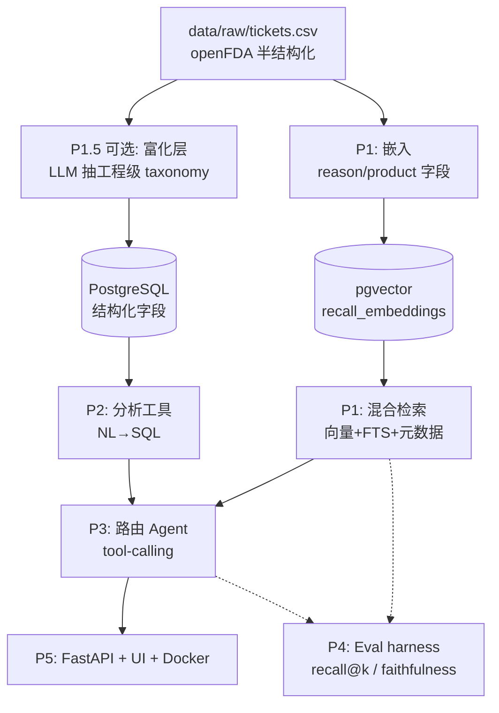

# MRI Ticket Intelligence Agent — 详细开发计划 (v2)

> 本计划取代旧的"重型结构化 pipeline"思路。
> 背景：openFDA 数据已是**半结构化**（FDA 模板提供了粗粒度字段），所以工作重心从"清洗脏数据"上移到 **检索质量 / Agent / 评估 / 部署** —— 这四块才是北美 MLE / AI Engineer JD 真正考察的。
> 目标岗位信号：RAG、向量检索、Agentic tool-use、Evaluation、LLM 工程化、部署。
> **数据集已切到 openFDA `drug/enforcement`**（非 MRI 工单；MRI 仅作设计隐喻保留）。**实时状态以 [PROGRESS.md](PROGRESS.md) 为准**；本文是稳定路线图 + 选型。
> 最后更新：2026-06-25

---

## 0. 数据现状校准（决定了计划怎么走）

| 维度 | 现状 | 含义 |
| --- | --- | --- |
| 结构化程度 | FDA 给了 `event_type`(4类)、`product_problems`(监管粗类)、`brand/manufacturer/date` | **粗粒度已有**，不用从零分类 |
| 自由文本 | `ticket_text` 里仍有工程级细节（部件、root cause、SAR值、纠正措施） | **细粒度仍需抽取**（可选 P1.5） |
| 噪声 | 仍有模板免责声明、多段重复/乱序 narrative | 你的"模板噪声过滤"技能仍有用 |
| 规模 | 已拉 2000 条；可扩到 ~3000（MRI）或更多（放宽 query） | 够做一个有说服力的 demo |

**结论**：不重做重型清洗 pipeline。直接进入检索 + Agent，**可选**插入一个轻量富化层（P1.5）来展示"分类 + 评估"功力。

---

## 1. 总体架构



**一句话数据流**：openFDA 文本 →（可选富化）→ 切块入向量库 + 字段入 SQL → 混合检索 + 分析工具 → 路由 Agent 统一调度 → API/UI 暴露 → Eval 全程把关。

---

## 2. 技术选型总表（务实、低成本、可上线）

> 图例：✅ 已落地　🔜 已定·待建

| 层 | 选型 | 备选 | 为什么 |
| --- | --- | --- | --- |
| 语言 | ✅ **Python 3.13** | — | 与你技能一致、生态最全 |
| LLM（NL→QuerySpec / Agent 推理） | ✅ **gpt-4o-mini**（`OPENAI_MODEL` 可调） | gpt-4o / gpt-4.1 / Claude | 受约束 spec 生成够用又便宜；复杂 routing 可临时升级 |
| Embedding | 🔜 **text-embedding-3-small**（1536 维） | -3-large / bge-small(本地免费) | 性价比最高；药品文本纯英文够用，~$0.05 |
| 向量库 | ✅ **pgvector**（Postgres 内） | Chroma / FAISS / Qdrant | 一个库搞定结构化 + 向量，无需额外服务 |
| 关键词检索 | 🔜 **Postgres 全文检索（FTS, `ts_rank`）** | pg_search(真 BM25) / rank-bm25 / ES | v1 留在 Postgres、带词干化；FTS 召回不够再上真 BM25 |
| 混合融合 | 🔜 **RRF**（Reciprocal Rank Fusion） | 加权和 | 无需调权重，简单稳健 |
| 重排 / 校验 | 🔜 **LLM 逐条判定 + 证据片段** | bge-reranker / Cohere | 与“逐条校验”层合并；高精度 + 可解释 |
| 结构化数据 | ✅ **PostgreSQL**（Postgres.app 17） | SQLite / DuckDB / Snowflake | 同库承载向量；生产可换 Snowflake |
| 结构化输出 | ✅ **Pydantic v2 + OpenAI structured output** | Instructor 库 | schema 校验、防 LLM 漂移 |
| 重试 / 限流 | **tenacity** | 自写 backoff | 指数退避、稳态批处理 |
| Agent 框架 | 🔜 **OpenAI function calling 原生** | LangGraph（进阶可选） | 先用原生，别一上来上重框架 |
| 实体解析（Phase 3） | 🔜 **pg_trgm 模糊 + 已知子公司展开 + LLM 核验** | fuzzystrmatch / dedupe | firm 名碎片化（1,634 个）；名变体 + 子公司需归并 |
| 评估 | 🔜 **自写 harness + 版本化黄金集** | ragas / promptfoo | 数字来自 SQL → 可精确断言；模糊维度才用 LLM-judge |
| 可观测 / 追踪 | 🔜 **query_log（Postgres, L1）→ Langfuse（L2）** | Phoenix / Helicone / OTel | 每次 /ask 一条 trace，`QuerySpec` 即可审计推理；自建表兼作 eval 数据集 |
| 后端 | ✅ **FastAPI + uvicorn** | Flask | 异步、自动文档、业界标配 |
| 前端 | ✅ **静态 HTML + Chart.js（FastAPI 托管）** | Streamlit / Next.js | 单进程单镜像、零构建步骤 |
| 容器 | ✅ **Docker**（镜像源参数化、密钥运行时注入） | — | 部署一致性、简历必备 |
| 托管（公开部署） | 🔜 **Hugging Face Spaces**（免费） | Render / Fly.io / Railway | 免费挂 live demo |
| 数据库（公开部署） | 🔜 **Supabase / Neon**（自带 pgvector） | RDS | 云容器连不到本机 localhost，需托管库 |

> **省钱模式**：embedding 用本地 `bge-small`，LLM 用本地 `Llama-3.1-8B`（Ollama），全程 0 API 费用。但起步建议用 OpenAI（快、省心），2000 条成本仅几美元（见 §9）。

---

## 3. Phase 1.5（可选）— 工程级富化层 `src/enrich.py`

> **要不要做**：想展示"taxonomy 设计 + 分类 + Cohen's κ"就做（这是你公司老本行，能直接对应简历）。只想快速出 RAG 就跳过，直接用 FDA 原字段。

### 目标
从 `ticket_text` 抽取 FDA 字段没有的**工程维度**，落成结构化列：

| 字段 | 取值示例 | 用途 |
| --- | --- | --- |
| `subsystem` | cooling / gradient / RF / magnet / patient_table / software / power | 工程分类（检索过滤 + 分析） |
| `failure_mode` | overheating / quench / image_artifact / software_crash / burn | 故障模式统计 |
| `root_cause` | 自由短语 | RAG 引用 |
| `corrective_action` | replaced_coil / software_update / no_action | 解决方案分析 |
| `severity` | patient_injury / downtime / no_impact | 优先级 |
| `is_template_noise` | bool（整段是否为法律免责声明） | 过滤噪声 |

### 怎么做
1. **多段合并去重**：一条报告的多个 `[Narrative]` 段先按类型合并、去重复句（你真实数据里大量重复段）。
2. **噪声剥离**：用规则 + LLM 判定，剔除 Medtronic 那种 `THIS REPORT DOES NOT CONSTITUTE AN ADMISSION...` 模板段。
3. **LLM 抽取**：`gpt-4o-mini` + Pydantic schema，一次输出上表所有字段（强制 JSON）。
4. **置信度**：让模型对 `subsystem` 输出 confidence，低置信度的进人工抽检集。

### 工程优化（重点，简历会问）
- **异步批处理**：`asyncio` + `Semaphore(并发=8~10)`，2000 条几分钟跑完，别串行。
- **指数退避**：`tenacity` 处理 429/超时；400（内容过长）才触发截断/分块，不要默认分块（这是你真实经验里的优化点，照搬）。
- **Checkpoint 续跑**：每 100 条落盘 `data/processed/enriched.parquet` + 记录已处理 `report_id`，中断可续。
- **幂等**：以 `report_id` 为键，重复跑不重复花钱。
- **Schema 校验**：Pydantic 解析失败→自动 repair prompt 重试一次→仍失败标 `parse_error` 入死信。
- **成本控制**：先抽样 50 条调 prompt，定稿再全量；prompt 里别塞整段噪声（先剥离再喂，省 token）。

### 产出
`data/processed/enriched.parquet`（原字段 + 新工程字段）。

---

## 4. Phase 1 — 混合检索 + RAG（🏆 核心，先做这个）`src/index.py` + `src/retrieve.py`

### 目标
能对 2000 条做**高质量语义检索**，并在此之上做**带引用的问答**。这是整个系统的脊柱。

### Step 1：切块（Chunking）`index.py`
- **策略**：按 narrative 段落切，目标 **300–500 token/块**，**overlap 50 token**。
- **为什么不整条入库**：你数据里单条最长 11k 字符，整条 embedding 会稀释语义、超模型上下文。
- **保留元数据**：每个 chunk 带 `report_id / brand / event_type / date / product_problems`（+富化字段）→ 支持**带过滤的检索**。
- **优化**：太短的块（<60 字符，如纯免责声明）直接丢；去重相同 chunk。

### Step 2：Embedding + 入库
- 模型 `text-embedding-3-small`；**批量** embedding（一次 100 条/请求，别一条一条调）。
- 入 **Chroma**（本地持久化到 `.chroma/`）。
- **优化**：embedding 结果**缓存**（按 chunk 文本 hash），改代码重跑不重复花钱。

### Step 3：混合检索（Hybrid）`retrieve.py`
- **三路召回**：
  1. **Dense**（向量相似）：语义匹配。
  2. **Sparse（BM25）**：精确术语匹配（型号、错误码、"SAR"、"quench"）。
  3. **Metadata 过滤**：`brand=...`、`event_type=Malfunction`、`date` 区间。
- **融合**：用 **RRF（Reciprocal Rank Fusion）** 合并 dense+sparse 排名（简单、无需调权重）。
- **重排**：`bge-reranker-base` 对融合后的 top-20 重排，取 top-5 给 LLM。
- **为什么要混合**：纯向量会漏掉精确术语（型号/错误码），纯 BM25 不懂同义；医疗工程文本两者都需要。这是面试高频考点。

### Step 4：RAG 问答
- 把 top-5 chunk + 元数据塞进 `gpt-4o` 的上下文，**强制带引用**（输出里标 `[report_id]`）。
- **防幻觉**：system prompt 明确"只基于提供的 context 回答，无依据就说不知道"。
- **引用可追溯**：答案里每个结论挂到具体 `report_id`，前端可点开原文。

### 工程优化
- **上下文预算**：top-k 控制在 5、每块 ≤500 token，留足回答空间；超了先 rerank 砍。
- **查询改写**：用户问句先经一次轻量 LLM 改写/扩展（query expansion），提升召回。
- **缓存**：相同 query 缓存结果（demo 演示时秒回）。

### 产出
能跑的检索 + RAG 模块；CLI 可问答。

---

## 5. Phase 2 — 分析 Agent（NL→SQL）`src/analytics.py`

### 目标
自然语言问**统计类**问题，自动出表/趋势。补"检索"答不了的聚合问题。

### 怎么做
1. 结构化字段（原 + 富化）入 **SQLite/DuckDB**。
2. **NL→SQL**：`gpt-4o` 把"按年份给出 software 类 malfunction 趋势"翻译成 SQL。
3. 执行 → 返回表格/简单图（matplotlib）。

### 工程优化（安全是重点）
- **只读 + 白名单**：连接只读；**只允许 SELECT**；正则/AST 拦截 `DROP/UPDATE/DELETE`（防 SQL 注入，OWASP）。
- **Schema 注入**：把表结构 + 字段含义放进 prompt，提升 SQL 正确率。
- **失败重试**：SQL 报错→把错误信息回喂 LLM 修正一次。
- **结果上限**：`LIMIT` 兜底，防止把全表拉进上下文。
- **固定约束**：用户筛选条件（如 brand）以参数化方式绑定，别让 LLM 自由拼。

### 产出
分析工具函数，能回答聚合/趋势类问题。

---

## 6. Phase 3 — 路由 Agent（tool-calling）`src/agent.py`

### 目标
一个 Agent 自动判断该用**语义检索**还是**统计分析**，统一入口。

### 怎么做
- **OpenAI function calling 原生**（先别上 LangGraph）。注册 3 个 tool：
  1. `search_tickets(query, filters)` → P1 混合检索
  2. `analyze_tickets(question)` → P2 NL→SQL
  3. `find_similar(report_id)` → 按某条找相似
- LLM 看用户问题→决定调哪个 tool→拿结果→组织成最终答案（带引用）。
- **进阶（可选）**：用 **LangGraph** 显式画状态机（classify→plan→execute→respond），简历上能说"用 LangGraph 做了 agentic workflow"。

### 工程优化
- **工具描述要精准**：function 的 description 直接决定路由准确率，反复打磨。
- **最大步数限制**：防止 agent 死循环（max_iters=5）。
- **可观测**：打印每步 tool 调用 + 参数（demo 时让招聘官看到 agent 在"思考"）。
- **错误兜底**：某 tool 失败，agent 要能降级回答而非崩溃。

### 产出
统一对话式 Agent。

---

## 7. Phase 4 — 评估 Harness（⭐ 差异化加分项）`src/eval.py`

> 90% 的作品集**没有 eval**。有了它，你立刻比大多数候选人专业。这是你简历里 "Model Evaluation (Accuracy, F1, Cohen's κ)" 的真实落地。

### 三层评估
1. **检索质量**：
   - 手工标 ~30 条 query→相关 report 的小 golden set。
   - 指标：**recall@k、MRR、nDCG**。对比"纯向量 vs 混合 vs 混合+rerank"，画提升曲线（简历金句）。
2. **RAG 答案质量**：
   - **Faithfulness（忠实度）**：答案是否有 context 支撑（LLM-as-judge，用 gpt-4o 打分）。
   - **Answer relevance**：答案是否切题。
   - 可选用 **ragas** 库现成指标。
3. **富化分类质量**（若做了 P1.5）：
   - 人工标 ~100 条 `subsystem`，算 **precision/recall/F1**。
   - 跑两次算 **Cohen's κ**（标签稳定性）——你真实经验里的 87% 稳定性同款做法。

### 工程优化
- **固定测试集 + 版本化**：golden set 入 git，改 prompt 后能回归对比。
- **LLM-as-judge 去偏**：judge 用不同模型、给明确 rubric、必要时人工抽检校准。
- **结果落盘**：每次 eval 出一张对比表（markdown/W&B），README 里放提升数据。

### 产出
`eval/` 目录 + 一张"检索策略对比"结果表（简历可引用的硬指标）。

---

## 8. Phase 5 — 部署 `src/api.py` + `app.py` + `Dockerfile`

### 目标
招聘官能点开一个 **live demo** + 看到干净 API。

### 怎么做
- **FastAPI** 暴露：`/search`、`/ask`、`/analyze`、`/agent`（自动 Swagger 文档）。
- **Streamlit** 前端：输入框 + 结果卡片（带引用可展开原文）+ 分析图表。
- **Docker** 打包；**Hugging Face Spaces** 免费托管（或 Render/Fly.io）。
- README 放：架构图、demo GIF、live 链接、eval 结果。

### 工程优化
- **冷启动**：向量库、reranker 模型在启动时加载一次，别每请求加载。
- **超时 + 限流**：API 层加超时、简单速率限制。
- **密钥**：`OPENAI_API_KEY` 走环境变量/Spaces secret，**绝不进 git**。
- **健康检查**：`/health` 端点。

### 产出
可访问的在线 demo + GitHub 链接。

---

## 9. 成本估算（2000 条，OpenAI 起步价位级别）

| 项目 | 用量 | 量级 |
| --- | --- | --- |
| 富化 P1.5（gpt-4o-mini） | 2000 条 × ~1.5k token | 约 $1–3 |
| Embedding（3-small） | ~6000 chunk × ~400 token | 约 $0.1 |
| RAG/Agent 问答（gpt-4o） | 演示/测试几百次 | 约 $1–5 |
| Eval（LLM-as-judge） | 几百次判分 | 约 $1–3 |
| **合计** | | **约 $5–15** |

> 想 $0：embedding 换 `bge-small`、LLM 换 Ollama 本地 `Llama-3.1-8B`，仅性能/质量略降。**建议起步用 OpenAI**（省时间），定稿后想省再换本地。

---

## 10. 文件结构（目标）

```
ticket agent/
  data/
    free_all.xlsx              # 真实数据，git-ignored，仅本地
    raw/tickets.csv|jsonl      # openFDA 拉取（可重建，git-ignored）
    processed/enriched.parquet # P1.5 产出（git-ignored）
  src/
    fetch_openfda.py           # ✅ 已完成
    enrich.py                  # P1.5 富化层（可选）
    index.py                   # P1 切块 + embedding + 入库
    retrieve.py                # P1 混合检索 + rerank
    analytics.py               # P2 NL→SQL
    agent.py                   # P3 路由 agent
    eval.py                    # P4 评估
    api.py                     # P5 FastAPI
  app.py                       # P5 Streamlit 前端
  eval/golden_set.json         # 评估测试集（入 git）
  Dockerfile                   # P5
  requirements.txt             # ✅ 已完成
  README.md                    # 持续更新（架构图/demo/eval 结果）
```

---

## 11. 排期（6 周，在职晚上/周末）

| 周 | 阶段 | 交付 |
| --- | --- | --- |
| **W1** | P1 切块+embedding+入库；跑通基础向量检索 | 能语义搜工单 |
| **W2** | P1 混合检索（BM25+RRF+rerank）+ RAG 问答 | 带引用问答 |
| **W3** | P4 检索 eval（golden set + recall@k 对比） + （可选）P1.5 富化 | 一张提升对比表 |
| **W4** | P2 NL→SQL 分析工具 | 能答趋势/统计 |
| **W5** | P3 路由 Agent（function calling） | 统一对话入口 |
| **W6** | P5 FastAPI+Streamlit+Docker+部署；README/demo 打磨 | **live demo 上线** |

> 若想压缩到 3 周：W1→P1，W2→P3 简版 agent，W3→P5 部署，**跳过 P1.5 和深度 eval**（但 eval 是加分项，尽量保留检索 recall@k 那部分）。

---

## 12. 简历映射（做完能写什么）

- Built a **hybrid-retrieval RAG agent** over 2K public medical-device reports: dense (text-embedding-3) + BM25 + RRF fusion + cross-encoder rerank, improving recall@5 from X% to Y%.
- Designed a **tool-calling agent** (OpenAI function calling) routing between semantic search and NL-to-SQL analytics; served via **FastAPI + Docker**, deployed on Hugging Face Spaces.
- Built an **evaluation harness** (recall@k, MRR, RAG faithfulness via LLM-as-judge; Cohen's κ for label stability) to quantify retrieval/answer quality.
- (可选) Engineered an **async LLM enrichment pipeline** (asyncio + tenacity backoff + checkpointing + Pydantic schema validation) extracting engineering-level taxonomy from noisy narratives.

---

## 13. 立即下一步

1. **本周 W1**：写 `src/index.py`（切块+embedding+Chroma 入库）+ `src/retrieve.py`（先基础向量检索）。
2. 填 `OPENAI_API_KEY` 到 `.env`，跑通 2000 条入库。
3. 验证：问 "patient burn during MRI" 能否召回相关报告。

> 决策点（开工前定一下）：
> - **要不要做 P1.5 富化层？**（展示分类+κ → 做；只求快 → 跳过）
> - **Embedding/LLM 用 OpenAI 还是本地？**（求快省心 → OpenAI；求 0 成本 → 本地 bge+Ollama）
> - **前端 Streamlit 还是 Next.js？**（求快 → Streamlit；想更像产品/兼顾 SDE → Next.js）
