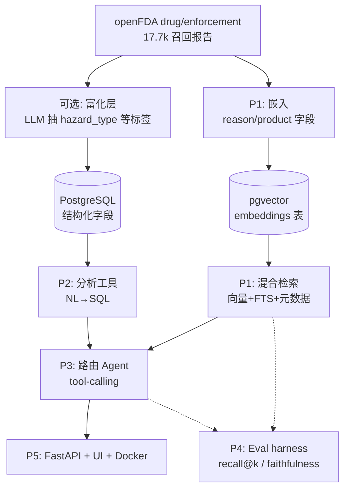

# FDAgent — openFDA 药品召回智能体 · 开发计划 (v3)

> **数据集：openFDA `drug/enforcement`**（美国 FDA 药品召回执法报告，100% 公开、无 PII）。
> 这是一个**完全公开**的作品集项目：数据与代码均可上网，不涉任何专有/公司内部内容。
> 背景：openFDA 数据已是**半结构化**（FDA 模板给了粗粒度字段），工作重心放在 JD 真正考察的四块：**检索质量 / Agent / 评估 / 部署**。
> 目标岗位信号：RAG、向量检索、Agentic tool-use、Evaluation、LLM 工程化、部署。
> **实时状态以 [PROGRESS.md](PROGRESS.md) 为准**；本文是稳定路线图 + 选型。
> 愿景：不只是"自然语言查库"，而是**以 FDA 数据为 Ground Truth 的垂直 Agent**——个人场景(拉/Q&A：这药、这公司安不安全) + 企业场景(推/监控：关注的器械/公司有何新动态)；FDA=事实层，web/Wikidata=增强层，二者严格分离、互不污染。
> 最后更新：2026-06-29

---

## 0. 数据现状校准（决定了计划怎么走）

| 维度 | 现状 | 含义 |
| --- | --- | --- |
| 结构化程度 | FDA 给了 `classification`(I/II/III)、`status`、`product_type`、`recalling_firm`、`state`、各类日期 | **粗粒度已有**，可直接做过滤/聚合（Tier-A 硬字段） |
| 自由文本 | `reason_for_recall`（为什么召回）、`product_description`（什么产品）——较短（p95 ~300 字符） | 语义检索的主目标；短文本**不用切块** |
| 规模 | `drug_enforcement` 17,723 条（单文件可下载） | 右尺寸：够有说服力，又能本地全量跑 |
| 母公司层级 | 库里没有；`recalling_firm` 名碎片化（1,634 个） | 实体解析是 Phase 3 的核心难点 |

**结论**：数据已半结构化，不做重型清洗。直接做 **确定性聚合（Path 1）+ 语义/混合检索（Path 2）+ Agent + 评估 + 部署**。

---

## 1. 总体架构

**一句话数据流**：openFDA 文本 →（可选富化）→ 切块入向量库 + 字段入 SQL → 混合检索 + 分析工具 → 路由 Agent 统一调度 → API/UI 暴露 → Eval 全程把关。

---

## 2. 技术选型总表（务实、低成本、可上线）

> 图例：✅ 已落地　🔜 已定·待建

| 层 | 选型 | 备选 | 为什么 |
| --- | --- | --- | --- |
| 语言 | ✅ **Python 3.13** | — | 与你技能一致、生态最全 |
| LLM（NL→QuerySpec / Agent 推理） | ✅ **gpt-4o-mini**（`OPENAI_MODEL` 可调） | gpt-4o / gpt-4.1 / Claude | 受约束 spec 生成够用又便宜；复杂 routing 可临时升级 |
| Embedding | ✅ **text-embedding-3-small**（1536 维）；🔜 query embedding 走 **OpenRouter** `openai/text-embedding-3-small` | -3-large / bge-small(本地免费) | 已存 pgvector 依赖同一 1536-d embedding space；当前 direct OpenAI quota 会让查询降级到 FTS-only，需用 OpenRouter 统一 endpoint/key 恢复 hybrid |
| 向量库 | ✅ **pgvector**（Postgres 内） | Chroma / FAISS / Qdrant | 一个库搞定结构化 + 向量，无需额外服务 |
| 关键词检索 | ✅ **Postgres 全文检索（FTS, `ts_rank`）** | pg_search(真 BM25) / rank-bm25 / ES | v1 留在 Postgres、带词干化；FTS 召回不够再上真 BM25 |
| 混合融合 | ✅ **RRF**（Reciprocal Rank Fusion） | 加权和 | 无需调权重，简单稳健 |
| 重排 / 校验 | 🔜 **LLM 逐条判定 + 证据片段** | bge-reranker / Cohere | 与“逐条校验”层合并；高精度 + 可解释 |
| 结构化数据 | ✅ **PostgreSQL**（Postgres.app 17） | SQLite / DuckDB / Snowflake | 同库承载向量；生产可换 Snowflake |
| 结构化输出 | ✅ **Pydantic v2 + OpenAI structured output** | Instructor 库 | schema 校验、防 LLM 漂移 |
| 重试 / 限流 | **tenacity** | 自写 backoff | 指数退避、稳态批处理 |
| Agent-control guard | 🔜 **域/元问题/降级守卫层** | 单 prompt 直接产 QuerySpec | 先判断该不该查 FDA 数据，再选 SQL/retrieval/tool；避免 chitchat 进 DB、embedding 失败被误报为“无结果” |
| Agent 框架 | 🔜 **OpenAI function calling 原生** | LangGraph（进阶可选） | 先用原生，别一上来上重框架 |
| 实体解析（Phase 3） | 🔜 **pg_trgm 模糊 + 已知子公司展开 + LLM 核验** | fuzzystrmatch / dedupe | firm 名碎片化（1,634 个）；名变体 + 子公司需归并 |
| 评估 | ✅ **自写 harness + 版本化黄金集（v1）** | ragas / promptfoo | 数字来自 SQL → 可精确断言；模糊维度才用 LLM-judge |
| 可观测 / 追踪 | ✅ **query_log（Postgres, L1）**；🔜 Langfuse（L2） | Phoenix / Helicone / OTel | 每次 /ask 一条 trace，`QuerySpec` 即可审计推理；自建表兼作 eval 数据集 |
| 后端 | ✅ **FastAPI + uvicorn** | Flask | 异步、自动文档、业界标配 |
| 前端 | ✅ **静态 HTML/CSS/JS 聊天 UI（FastAPI 托管）** | Streamlit / Next.js | 单进程单镜像、零构建步骤 |
| 容器 | ✅ **Docker**（镜像源参数化、密钥运行时注入） | — | 部署一致性、简历必备 |
| 托管（公开部署） | 🔜 **Hugging Face Spaces**（免费） | Render / Fly.io / Railway | 免费挂 live demo |
| 数据库（公开部署） | 🔜 **Supabase / Neon**（自带 pgvector） | RDS | 云容器连不到本机 localhost，需托管库 |

> **省钱模式**：embedding 用本地 `bge-small`，LLM 用本地 `Llama-3.1-8B`（Ollama），全程 0 API 费用。但起步建议用 OpenAI（快、省心），2000 条成本仅几美元（见 §9）。

---

## 3. 分阶段路线（drug-recall 原生；实时状态见 [PROGRESS.md](PROGRESS.md)）

> 把架构落成可交付切片，每片都「可演示 + 带证据（`recall_number`）」。

### Path 1 — 确定性 NL→SQL 分析（✅ 已完成）
自然语言问**频率 / 趋势 / 分布**，每个数字都来自参数化 SQL（绝不让 LLM 编数字）。
- LLM 只产出受约束的 `QuerySpec`（列/值白名单 + schema 注入），再翻成只读、参数化 SQL。
- 安全（OWASP）：只读连接 + 只允许 SELECT + 列名走白名单 + 值走参数绑定（防注入）。
- 落地：`src/analytics.py`（聚合引擎）+ `src/nl_query.py`（NL→QuerySpec）。

### Path 2 — 语义 / 混合检索（✅ v1 已完成；需要 agent-control 加固）
答 Path 1 答不了的**模糊概念**问题（「无菌问题」「致癌杂质」「药效太强」）。
- 嵌入 `reason_for_recall` + `product_description` 入 `embeddings`（pgvector）。详见
  [频率查询系统设计](频率查询系统设计-过滤检索校验.md) §9。✅
- 概念走 `semantic_query` → 混合检索（pgvector + Postgres FTS + RRF，可叠加 Tier-A 硬过滤），不再用字面 `ilike`。✅
- 逐条 LLM 校验 + 语义计数（估计值 + 置信区间）已接入，`semantic_query` 可以与 `count_total` / `count_by` 组合。✅
- **当前设计缺口不是“要不要混合检索”，而是 agent-control + query embedding provider**：当 embedding provider 不可用时，系统会退化到 FTS-only；多词/口语化 query（`sterility problems`, `pills that are too strong`）在 FTS-only 下可能 0 命中，这不能被解释为“FDA 数据中没有”。当前运行时的具体缺口是：存量 `embeddings` 表完整，但查询 embedding 仍走 direct OpenAI；当 OpenAI embedding quota/key 路径触发 `ProviderQuotaError` 时，`query_log` 记录 `retrieval_mode=fts_only`。应支持 `EMBED_PROVIDER=openrouter`，通过 `https://openrouter.ai/api/v1/embeddings` + `OPENROUTER_API_KEY` 调用 `openai/text-embedding-3-small`，在不重嵌 corpus 的前提下恢复 query-vector + FTS 的 hybrid/RRF。同时，`who you are?` 这类元问题会被 QuerySpec 空间硬塞进 `sample`，返回无关 rows。
- **治理原则**：QuerySpec 前面必须有一层 `{in_domain, chitchat/meta, out_of_domain, ambiguous}` 守卫；semantic count 的 query rewrite 要保留核心概念并把 synonyms/expansions 分开；检索降级必须显式告诉用户和 `query_log`。

### 前端 — ChatGPT 式聊天 UI（✅ v1 已完成）
对话流 + 左侧会话栏 + 可编辑消息 + 随时停止。模块化静态文件（`index.html` / `app.js` /
`styles.css`），原生 JS、零构建（保持单进程单镜像）。历史存浏览器 `localStorage`；v1 每轮独立调用
`/ask`，对话上下文留到 v2（可与 `query_log` 关联）。

**🔜 v2（待 PR，状态见 [PROGRESS.md](PROGRESS.md) Next up）**：① 会话标题自动总结（方案 B——新增服务端 `POST /title`，`gpt-4o-mini` 据**首问话题**生成 ≤6 词短标题，每会话生成一次即固定，手动 rename 优先；key 仅在服务端）；② 侧栏 rename/delete 由两个大写字母改为图标（铅笔=改名、垃圾桶=删除，内联 SVG、零构建）；③ 历史仍存 `localStorage`，服务端持久化留到「对话上下文 v2」。

### 可观测 + 评估（差异化加分）
- **可观测**：每次 `/ask` 落 `query_log`（Postgres，L1）✅；接 **Langfuse**（L2）留到确认需要更强 trace UX 后。
- **评估**：版本化黄金集 v1 ✅；**数字来自 SQL → 可精确断言**（如「无菌」必须走 `semantic_query` 而非 `ilike`）；
  检索 recall@k 已覆盖，答案忠实度用 LLM-as-judge、标签稳定性用 Cohen's κ 留到后续。

### Agent-control layer — 从“查询器”变成“智能体”（🔜 后端/RAG 加固）
当前 `/ask` 已能做 SQL 分析、混合检索、语义计数，但还缺“是否应该查库 / 工具坏了怎么说 / 什么时候追问”的控制层。这个 backend slice 独立于 firm-resolution 3a+，应补：

1. **Domain/meta guard**：先判定 `in_domain` / `chitchat/meta` / `out_of_domain` / `ambiguous`。自我介绍、能力询问直接回答；无关问题说明 FDA-recall 范围；歧义问题追问；只有 `in_domain` 才进入 QuerySpec。
2. **Safe sample policy**：`intent=sample` 且无 `filters`、无 `semantic_query` 时禁止 `LIMIT 5` 随机返回，应改为澄清或能力说明。
3. **Conservative query rewrite**：计数/汇总类问题保留用户核心概念（如 `sterility`），把 `sterile`、`non-sterile`、`lack of assurance of sterility`、`superpotent` 等作为扩展/别名，不把核心 query 改窄成 `sterility problems`。
4. **Retrieval degradation policy**：`hybrid`、`fts_only`、`sql keyword` 是不同证据级别。embedding auth/quota/key 失败时，答案必须标记“degraded FTS-only”；FTS-only 0 命中时要说明“语义检索不可用，关键词 fallback 无命中”，不能当成事实上的 0。
5. **Fallback ladder**：FTS fallback 应从严格 query 逐步放宽到核心词、synonym/alias、OR-style broadening；仍无结果才返回带限制说明的空结果。
6. **Eval/observability coverage**：golden eval 覆盖 meta/chitchat、out-of-domain、empty sample prevention、conservative rewrite、degraded retrieval metadata；`query_log` 保留 guard decision、route、retrieval mode、fallback reason。

**Done when:** `query_log` 中 meta/out-of-domain 不再产生 SQL rows；`How many sterility recalls...` 不再被重写成更窄的 `sterility problems`；embedding 不可用时，用户能看到降级说明而不是静默 0。

### Phase 3 — 路由 Agent（tool-calling 资本式整合）
一个 agent 自动在 **语义检索 / 统计分析 / 实体解析 / web 搜索** 间路由。杀手级用例：「我买了某药，这家公司安不安全？」
→ 品牌→母公司 `[inferred]` → `recalling_firm` 实体解析 → 复用分析引擎做风险画像 → 答案**严格区分 [推断] 与 [事实]**、带证据。原生 OpenAI function calling，先不上 LangGraph。

**实体解析（核心难点，离线物化）**：firm 名碎片化（1,634 distinct）。
- **品牌→母公司**：分级信源 NDC labeler 目录(权威,仅~18% 记录有) > Wikidata > web/LLM；标 source+confidence、可确认（防 Kenvue 这类拆分/并购过时）。
- **firm 归一化=高召回多信号取并集**：pg_trgm 三元组 + 编辑距离 + token-set + 音似(metaphone) + 名嵌入(抓缩写) + NDC labeler 码(确定性合并)；阈值在 golden set 上校准，宁宽勿漏，再逐对 LLM 验证收窄。
- **聚类=union-find/社区发现**：候选对连图取连通分量，防传递性过合并（加权边+高阈值+LLM 拆簇）。
- **离线 side-car 表**（不动源表）：已落地的基础层是 `parent_group` / `firm` / `firm_alias(raw_firm→firm_id)` / `brand_alias` / `resolution_log`；下一层审计表应补 `firm_resolution_run` / `firm_match_pair`。**身份≠FDA 足迹**：firm 带 `fda_present`，无召回也能存(source=external)；查无此公司→记 `resolution_log`，不造实体。
- **生产化约束（先做 3a+，再做 3b Agent）**：openFDA 数据会通过 `fetch_openfda.py --since auto` 持续增量进入，firm resolution 不能只是一轮静态 full batch。每次 ingest 后都要能增量发现新 `recalling_firm`、刷新已有 alias 的 `record_count`/evidence、记录本次 run 的阈值和候选 pair 决策；高置信才自动合并，中置信进 review，未知进 `resolution_log`。只有这个 sidecar 可重复、可审计后，Agent 才应该消费它回答“公司/品牌安全吗？”。
- **NDC=验证器非主桥**（仅 18% 有 NDC、8.5% UPC、82% 无富化）；名字实体解析才是 100% 覆盖的主干。
- **web 搜索=仅增强层**，与 FDA 事实隔离、必引用；负结果表述为"FDA 数据未找到"，非"安全"。

### 部署
FastAPI `/ask` + `/health` + 静态 UI，Docker 打包（镜像源参数化、密钥运行时注入）。
公开上线：推镜像到 HF Spaces / Render + 托管 Postgres（Supabase / Neon，自带 pgvector）。

---

## 4. Phase 4 — 自动化召回分类（taxonomy 自生长，人只治理不标注）

> 取代旧做法"手写体系硬编码进 prompt"。原则：**LLM 当标注员 + 数据驱动建类**，人退到审批/抽检（TnT-LLM 范式：先诱导体系，再大规模打标，可蒸馏小分类器）。
> 数据现状：`reason_for_recall` 全有、仅 **4,390 distinct**、短(p95 小)、自带前缀小标题(`Labeling:`/`cGMP Deviations:`/`Lack of Assurance of Sterility`…) → 只标 distinct、前缀当种子，便宜。

四阶段，绝大部分离线、复用现有 `embeddings` 表：
- **P1 自动建类**：HDBSCAN 聚类 4,390 distinct → LLM 每簇起名/定义/父类 → 合并成两级 → 人工审一次冻结 v1（数十节点，分钟级）。
- **P2 自动打标**：闭集分类（LLM 结构化输出：多标签 + 置信度 + 证据片段 + `other` 兜底），按内容 hash 缓存、回贴 17.7k；低置信才升级模型；可蒸馏 embedding→label 小分类器近乎免费。
- **P3 发现回路（持续）**：`other`/低置信进残差池 → 周期聚类 → LLM 命名 → 与现有体系去重 → 按 大小/增长/凝聚度 排序 → 人工审候选 → vN+1。**稳定性闸门**：候选须够大、够凝聚、连续 N 批持续出现才升格（防体系抖动）。
- 表：`taxonomy(node_id,parent_id,label,definition,examples[],version,status)` / `recall_label(record_id,node_id,level,confidence,evidence,version,labeler)` / `taxonomy_candidate`。
- 评估：版本化 golden + 标签稳定性 + Cohen's κ；闭集 vs 开集、other 阈值校准。
- **收益**：标签结构化后，"某问题在各公司分布" = `WHERE node='sterility' GROUP BY recalling_firm` 精确计数，正好填掉 §3 的"语义×聚合"格——把语义计数从估计变精确。
- 工程点（面试会问）：异步批处理（`asyncio`+`Semaphore`）、`tenacity` 退避、checkpoint 续跑、按 `recall_number` 幂等、Pydantic 校验失败→repair→死信。

---

## 5. 成本估算（本数据集，OpenAI 起步价位）

| 项目 | 用量 | 量级 |
| --- | --- | --- |
| 嵌入（text-embedding-3-small） | 35,446 段（reason + product） | ~$0.05 |
| NL→QuerySpec / 检索问答（gpt-4o-mini） | 演示/测试几千次 | ~$1–5 |
| （可选）富化 + LLM-as-judge 评估 | 各几千次 | ~$1–3 |
| **合计** | | **约 $5 上下** |

> 想 $0：嵌入换本地 `bge-small`、LLM 换 Ollama 本地模型，质量略降。起步建议 OpenAI（省时间）。

---

## 6. 简历映射（做完能写什么）

- Built an **evidence-grounded NL→SQL analytics agent** over 17.7k public FDA drug-recall reports:
  an LLM emits a validated, whitelisted `QuerySpec` → parameterized read-only SQL, so **every figure is
  auditable** (carries the backing recall numbers) and never hallucinated.
- Added **hybrid semantic retrieval** (pgvector dense + Postgres FTS + RRF fusion) so fuzzy concepts
  ("pills that are too strong" → *superpotent*) match synonyms a literal keyword filter misses.
- Designed a **tool-calling agent** routing between semantic search, NL-to-SQL analytics, and **company
  entity-resolution** (fuzzy-matching a fragmented `recalling_firm` field to a parent company).
- Served via **FastAPI + Docker** with a chat UI; built an **eval harness** (recall@k, faithfulness via
  LLM-as-judge, Cohen's κ) and **observability** (per-request `/ask` traces).

---

## 附录 · 候选想法（未排期 backlog）

> 突发灵感，非当前主线；记录备查，条件成熟再排期。

### A1. 公司"暴露度"指数（Company Exposure Index）
类比 Karpathy 的"职业 AI 暴露度"：给每家公司/品牌算一个在 openFDA 负面信号里的**暴露度**，按**产品品类**切片可视化——"想买某类产品(药/器械/食品)，该品类里暴露风险最高的公司/品牌是谁"。

- **交互产物（参照 [karpathy.ai/jobs](https://karpathy.ai/jobs/) 的 treemap）**：瓦片=公司（或"品类→公司"两级），**面积 ∝ 规模**（产品/NDC 数或召回量），**颜色 = 暴露度分数**；品类下拉/图层切换换配色。
  - Karpathy 的关键设计：**两条视觉通道分离**——面积载"体量"(就业量)、颜色载"可切换的指标"(AI exposure / offshoring / …)，且指标由 **LLM 按自定义 prompt 逐条打分**，配**诚实 caveat**（粗略估计、非预测、高分≠会消失）。
  - **打分两模式（最好都做成可切图层）**：① 确定性 SQL 指数（召回数×严重度×时效÷产品数，可审计，合项目"数字来自 SQL"）；② LLM 打分（Karpathy 式可插拔 prompt，灵活但粗略）。
  - **正好化解"暴露度≠裸计数"**：体量放**面积**、归一化暴露放**颜色**——小公司若召回又多又重，瓦片小但颜色红。
- **耦合评估（诚实）：并非完全解耦。**
  - 复用：通用摄取 [src/fetch_openfda.py](src/fetch_openfda.py)（已支持任意 endpoint）+ Path 1 聚合（`count_by` 本质就是排行）+ 服务/图表层。
  - **强依赖 Phase 3 实体解析**：不归一化 `recalling_firm`（1,634 碎片），"每公司暴露度"就是错的（Pfizer 被拆成多个名字）。
  - 仅与 LLM/Agent/对话层解耦——可纯 SQL + 静态图先做个 teaser。
  - → 最佳定位：**Phase 3 之上的可视化 showcase**，给实体解析一个直观、作品集友好的落点；不建议当独立项目重起炉灶。
- **核心设计难点：暴露度 ≠ 原始召回数**。裸计数只会把最大的公司排前面（产品多→召回多≠更危险）。需**归一化 + 加权**：
  - 归一化：按产品/NDC 数、市场存在度（可用 NDC 目录产品数近似）。
  - 严重度加权：Class I > II > III。
  - 时间衰减：近期事件权重更高。
  - 品类切片：先用 `product_type`（drug/device/food），细粒度用 Phase 4 标签。
- **与 Karpathy 的结构差异**：BLS 的 342 个职业本就是干净规范的 taxonomy；FDA 的 firm 是 1,634 个碎片写法 → 要有干净的"瓦片实体"仍得先做 **Phase 3 实体解析**（这正是它依赖主线的根本原因）。v0 可先在 `product_type` 层、firm 原样接受噪声出图。
- **最小独立切片**（若想先快出一个）：单 `product_type` × 裸计数排行 + 一张静态图，无 LLM；但每公司数值要准，仍需先做实体解析。
