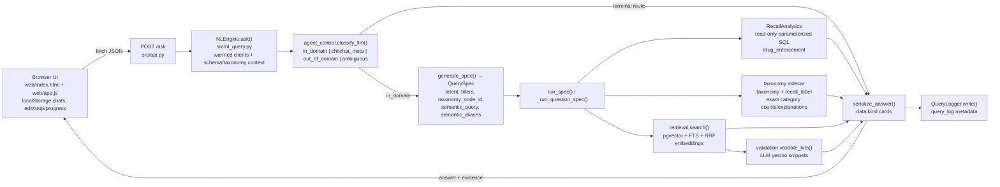
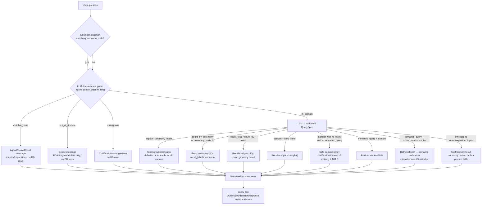
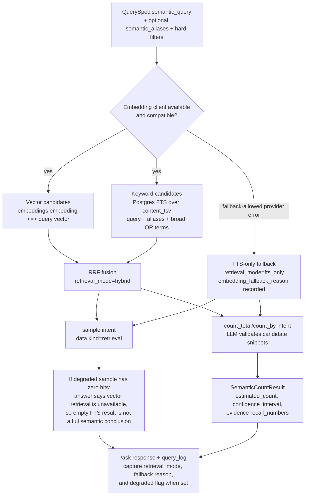

# FDAgent — openFDA Drug-Recall Intelligence Agent

Ask natural-language questions about U.S. **FDA drug-recall enforcement reports** and get
**evidence-backed** answers — frequencies, trends, and distributions computed in SQL (never
guessed by the model), each result carrying the recall numbers that back it.

> **Portfolio note.** This reproduces — on 100% **public-domain openFDA data** — the same
> applied-AI pipeline I built in industry (large-scale LLM structuring + analytics over noisy
> operational records). No proprietary data or code is used.

> **Live state → [PROGRESS.md](PROGRESS.md)** (single source of truth). Roadmap → [PLAN.md](PLAN.md);
> query design → [频率查询系统设计-过滤检索校验.md](频率查询系统设计-过滤检索校验.md);
> agent entry point + conventions → [AGENTS.md](AGENTS.md).

---

## What works today

- **Ingest** — [src/fetch_openfda.py](src/fetch_openfda.py): any openFDA endpoint → PostgreSQL (idempotent JSONB upsert, `--since auto` incremental). Loaded: `drug/enforcement`, ~17.7k recall reports.
- **Parse** — [sql/001_parse_drug_enforcement.sql](sql/001_parse_drug_enforcement.sql): the `raw` JSONB → 23 typed, indexed columns, documented with verbatim openFDA definitions ([sql/002](sql/002_drug_enforcement_comments.sql)).
- **Analytics engine** — [src/analytics.py](src/analytics.py): safe, parameterized, read-only `count / group-by / trend / sample`, returning evidence `recall_number`s.
- **NL→SQL layer** — [src/nl_query.py](src/nl_query.py): an LLM turns a question into a *validated* `QuerySpec` (columns/values whitelisted, schema + column comments injected) that runs through the analytics engine — so every number comes from SQL.
- **Serving** — [src/api.py](src/api.py): a FastAPI `/ask` endpoint + a zero-build ChatGPT-style UI ([web/index.html](web/index.html), [web/app.js](web/app.js), [web/styles.css](web/styles.css)) that renders answers and evidence; resources are warmed once at startup and requests are logged to `query_log`.
- **Hybrid search lab** — `GET/POST /hybrid-search` serves a separate debug UI for retrieval experiments, with safe progress states, vector/FTS/RRF metadata, CSV/JSON export, and per-run logging to `hybrid_search_log`.
- **Agent control** — [src/agent_control.py](src/agent_control.py): an LLM intent gate keeps meta/chitchat, out-of-domain, and too-vague prompts out of the database; only in-domain recall questions produce a `QuerySpec`.
- **Hybrid retrieval + semantic counting (Path 2)** — [src/embed.py](src/embed.py) + [src/retrieval.py](src/retrieval.py) + [src/validation.py](src/validation.py): recall text is embedded into a multi-source `pgvector` `embeddings` table; fuzzy concepts (e.g. "pills that are too strong" → *superpotent*) use pgvector + Postgres FTS with RRF, and count-style concept questions add LLM yes/no validation plus confidence bands. Query embeddings can use direct OpenAI or OpenRouter `openai/text-embedding-3-small` while staying compatible with the stored 1536-d corpus vectors.

## Agent workflow and routing

The diagrams below name the current serving-path modules. Live priorities and provider caveats
stay in [PROGRESS.md](PROGRESS.md).

### `/ask` request lifecycle



### Routing/control flow



### Hybrid retrieval and current degradation behavior



---

## Data: openFDA drug recall enforcement (public domain)

Source: [openFDA Drug Enforcement API](https://open.fda.gov/apis/drug/enforcement/) — U.S.-government
drug-recall reports, no PII. Each row keeps the full original record as `raw` JSONB plus parsed
columns (`classification`, `status`, `reason_for_recall`, `recalling_firm`, `state`, dates, …).

---

## Quick start

```bash
python3 -m venv .venv && source .venv/bin/activate
pip install -r requirements.txt
cp .env.example .env            # add provider keys and DATABASE_URL
# To route query embeddings through OpenRouter, keep:
# EMBED_PROVIDER=openrouter and EMBED_MODEL=openai/text-embedding-3-small

# Postgres (Postgres.app): create the db + enable pgvector
createdb fda && psql -d fda -c "CREATE EXTENSION IF NOT EXISTS vector;"
# If upgrading an existing local DB for the retrieval lab:
psql -d fda -f sql/010_hybrid_search_log.sql

# load data, then try the two engines
.venv/bin/python src/fetch_openfda.py --endpoint drug/enforcement --table drug_enforcement
.venv/bin/python src/analytics.py                                            # deterministic demo (no API key)
.venv/bin/python src/nl_query.py "Which firms had the most Class I recalls?"  # NL→SQL demo

# serve it: FastAPI /ask + chart UI, then open http://127.0.0.1:8000/
.venv/bin/python -m uvicorn src.api:app --reload
# retrieval lab/debug surface: http://127.0.0.1:8000/hybrid-search
```

---

## Run in Docker

The serving layer ships as a lean container ([Dockerfile](Dockerfile)): secrets and the database
are supplied **at run time**, never baked into the image. On Docker Desktop, the container reaches
the host's Postgres via `host.docker.internal`.

```bash
# build (the two --build-arg mirrors are only needed where Docker Hub / PyPI are slow, e.g. China)
docker build -t fdagent .
# docker build --build-arg REGISTRY=docker.m.daocloud.io \
#              --build-arg PIP_INDEX_URL=https://pypi.tuna.tsinghua.edu.cn/simple -t fdagent .

# run: pass the API key via .env, point DATABASE_URL at the host Postgres ($USER = your PG role)
docker run --rm -p 8000:8000 --env-file .env \
  -e DATABASE_URL="postgresql://$USER@host.docker.internal:5432/fda" \
  fdagent
# then open http://localhost:8000/
```

> Docker packages the app; it does **not** by itself make the site public. To open it to others,
> push the image to a host (Hugging Face Spaces / Render / Fly.io) **and** use a managed
> Postgres + pgvector — a cloud container cannot reach your `localhost`. See [PROGRESS.md](PROGRESS.md).

---

## Tech stack

Python 3.13 · PostgreSQL + `pgvector` + `hypopg` · `psycopg` 3 · OpenAI-compatible chat
and query-embedding providers with Pydantic-validated structured output · FastAPI + a static Chart.js UI · Docker ·
a read-only Postgres MCP for safe schema exploration.

---

## IP safety

Real company data is **git-ignored** and never committed; everything here is public-domain
openFDA (or synthetic). Secrets live in `.env` (git-ignored; template in [.env.example](.env.example)).
