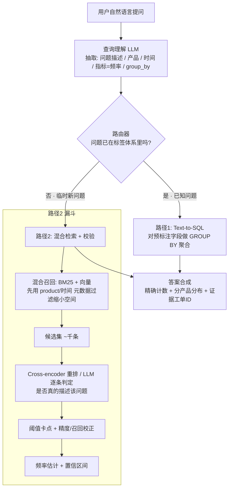
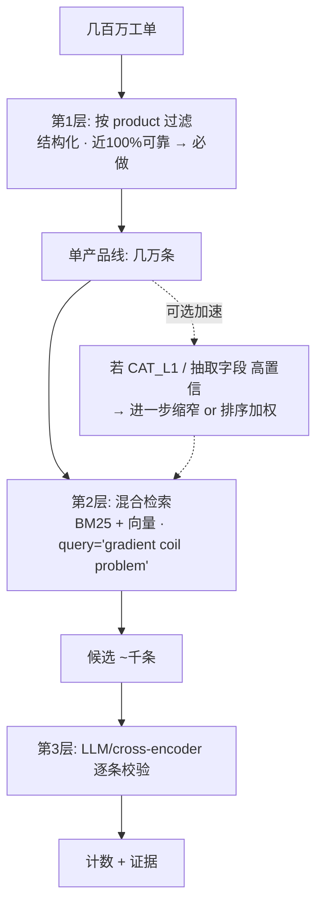
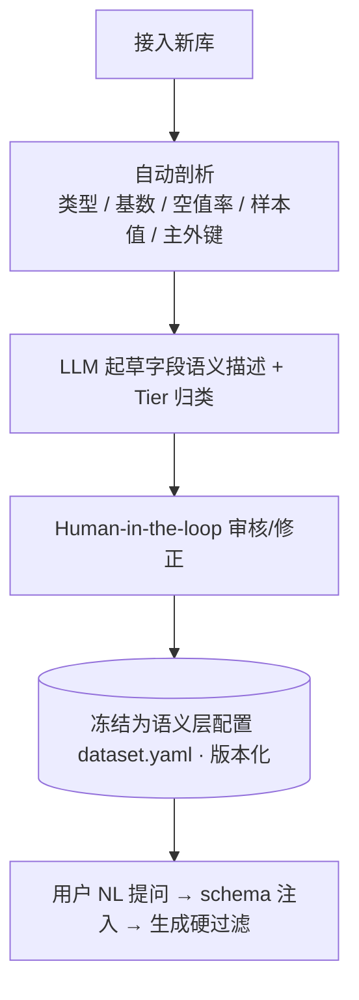
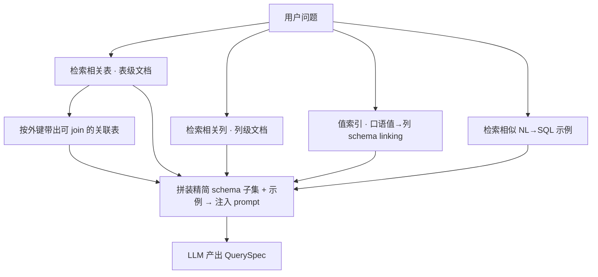

# 频率/聚合类查询系统设计（过滤 → 检索 → 校验）

> 配套 [PLAN.md](PLAN.md)。本文专门解决一类高频需求：
> **"某个问题在某些产品上的发生频率"**（如 _gradient coil problem 在 MAGNETOM 系列上发生了多少次_）。
> 这类需求看似是"搜索"，本质却是"聚合/计数"，设计上极易踩错。
> 最后更新：2026-06-24

---

## 0. 一句话结论

> **频率/计数 ≠ top-K 检索。** 它是"先用语义把模糊问题映射成一个**可计数的集合**，再做聚合"的问题。
> 系统骨架是一个三层漏斗：**结构化字段管"窄"(precision) → 混合检索管"全"(recall) → 逐条校验管"准"**。
> 唯一必须可靠的硬过滤是 `product`；分类/抽取字段只是"可选加速器"，缺失或不准都不会让计数崩。

---

## 1. 最容易踩的坑：把它当 RAG 做

很多人一听"用自然语言在海量工单里找问题"，就直接套标准 RAG：

```
query → embedding → 向量库 ANN → top-K → 丢给 LLM 总结
```

**在频率场景下这是错的：**

- top-K 只给"最像的 N 条"，但用户要的是"**一共发生了多少次、在哪些产品上分布如何**" —— 这需要对**全量**匹配工单做 recall，top-K 给不了。
- 计数对 **precision 和 recall 同时敏感**：漏一半 → 频率偏低；混入不相关 → 频率偏高。向量 top-K 既不保证全也不保证准。

✅ 正确心智模型：**语义匹配 → 可计数集合 → SQL/聚合**。

---

## 2. 核心原则：职责分离

| 组件 | 职责 | 关键指标 |
| --- | --- | --- |
| **结构化过滤（filter）** | 缩小搜索空间 | precision |
| **混合检索（BM25 + 向量）** | 保证不漏 | recall |
| **逐条校验（rerank / LLM judge）** | 确认"真的在描述该问题" | 精度 + 可解释 |

只要这三件事分开、取**并集再校验**，**任何单个字段（含 CAT_L1）缺失或不准，都不会让结果崩** —— 因为完整性不依赖任何单一字段。

---

## 3. 系统架构：两条路径 + 一个路由器

核心思想：**能离线预计算的，绝不在线算。** PLAN.md 里 P1.5 富化层产出的结构化标签，正是这套系统的地基。



### 路径 1：预标注 + Text-to-SQL（**高频问题首选**）

对于"已经在 taxonomy 里"的问题，LLM 管线离线已打好结构化标签，在线只需聚合：

```sql
SELECT product, COUNT(*) AS cnt
FROM tickets
WHERE category_l2 = 'gradient_coil_overheating'
  AND product IN ('MAGNETOM ...', ...)
GROUP BY product
ORDER BY cnt DESC;
```

- **快、便宜、可审计**：精确计数，不是估计。
- chatbot 在此退化为 **语义层 + text-to-SQL**，把自然语言翻译成对数仓的查询。
- 90% 的"找问题分布"是反复问的、可枚举维度，最优解就是这条。

### 路径 2：混合检索 + 校验（**临时/新问题才走**）

当问题**不在现有标签里**，才需要在线语义匹配。生产做法是漏斗，**绝不对几百万条逐条跑 LLM**：

1. **元数据预过滤**：用 `product` + 时间，把几百万砍到单产品线的几万条。
2. **混合召回**：BM25（型号/错误码/术语，如 `SAR`、`quench`）**+ 多语言向量**（同义/改写/跨语言），取并集缩到几千条。
3. **精排/判定**：cross-encoder 重排，或 LLM 对候选**逐条 yes/no 判定**。只在几千条上跑，成本可控。
4. **阈值 + 校正**：在人工 golden set 上标定阈值，算出该阈值下的 precision/recall，对最终计数做修正并给**置信区间**。

> 诚实点：百万级"语义穷尽计数"本质是**统计估计问题**。要么离线固化成标签（路径1），要么明确告诉用户"这是带置信区间的估计值"。能讲清这点，面试就是加分项。

---

## 4. 关键设计决策：不要把 CAT_L1 当"硬门槛"

这是本次讨论的核心。**CAT_L1 不是 gate，只是可选加速器。**

### 4.1 过滤层级（按可靠性排序）



- **唯一必须可靠、可硬过滤的是 `product`**：光靠它就把几百万 → 单产品线几万条，足够后续检索跑得动。
- **CAT_L1 缺失或不准 → 最坏只是少了一次加速**，绝不会把本该计入的工单错误排除。

### 4.2 "只有关键信息抽取字段、没有问题分类"怎么办？

**用你信得过的抽取字段来 narrow，反而比用粗 L1 更好：**

- `gradient coil problem` 这个 query，本就该映射到 **`component = gradient_coil`** 这种细粒度抽取字段，而不是去赌 L1 里有没有一个 gradient 大类。
- 抽取字段**粒度更细、更贴近用户问法**，是更优的缩窄信号。
- 即便某些工单 component 漏抽，第 2 层的 **向量 + BM25 仍会在该产品全量里捞回来**（recall 兜底）。**漏抽不会变成漏算。**

### 4.3 用置信度决定字段怎么用（per-field confidence 正好派上用场）

不要"有字段就硬过滤"，按置信度分档：

| 字段置信度 | 用法 |
| --- | --- |
| 高（如 `product`，或高置信 `component`） | **hard filter**：直接缩小集合 |
| 中 | **soft boost**：不排除，只在排序里加权 |
| 低 / 缺失 | **完全不用它过滤**，纯靠检索召回 |

> 结果：任何分类/抽取字段不准或为空，**最坏只是少一次加速，绝不误排除应计入的工单**。
> 计数完整性始终由"`product` 硬过滤 + 全量混合检索 + 逐条校验"这条主干保证。

---

## 5. 生产细节清单

| 关注点 | 做法 |
| --- | --- |
| **多语言**（中/英/德） | 多语言 embedding（`bge-m3` / `multilingual-e5`），让中文 query 命中德文工单；或离线统一翻译成 pivot 语言再 embed |
| **成本** | 嵌入、分类全部**离线批处理**；在线只在候选集（千级）上算；高频 query 缓存 |
| **延迟** | 元数据预过滤 + ANN（HNSW），先缩空间再算语义 |
| **防幻觉 / 可信** | 答案必须**附真实工单 ID 作证据**；计数来自 SQL/检索结果，**绝不让 LLM 自己编数字** |
| **闭环 / 主动学习** | 用户确认某次临时匹配后，把它**晋升进 taxonomy**，下次走便宜的路径1（human-in-the-loop 的自然延伸） |
| **评估** | 检索 precision@k / recall、阈值校准曲线、最终答案正确性（复用 PLAN.md P4 的 eval 文化） |

### 技术选型（贴合已有栈，与 PLAN.md 一致）

- 向量库：**pgvector**（一个 Postgres 搞定结构化 + 向量）或 Chroma/Qdrant
- 关键词：**rank-bm25**（本地）或 OpenSearch（BM25 + 过滤）
- 结构化聚合：**SQLite / DuckDB**（demo）→ Snowflake（生产）
- 编排：async Python + Azure/OpenAI；chatbot 层 FastAPI + 轻量 agent

---

## 6. 落地建议（最小可见切片）

别一上来做完整双路径，按以下顺序：

1. **先做路径1 的 text-to-SQL chatbot**：基于已标注 taxonomy，做"自然语言问工单分布"对话界面（FastAPI + Streamlit）。能回答"问题 X 在产品 A/B/C 上各多少次、趋势如何"，**带分产品柱状图 + 证据工单**。这一步已是一个完整可演示的 AIE/MLE 项目。
2. **再加路径2 的混合检索 fallback**：处理 taxonomy 里没有的新问题，展示 hybrid retrieval + LLM 校验 + 阈值校准 + 置信区间。
3. **写清 README + 架构图 + 评估数字**：检索 recall、阈值校准、cost/latency，把"LLM 工程化 + 严谨评估"的差异化打满。

> 项目故事性：**真实痛点 → 揭示"计数 ≠ 检索"的设计陷阱 → 混合架构 + 离线预计算 + 统计校准解决**。比又一个 toy RAG demo 有说服力得多。

---

## 7. Scalability / 跨域泛化（从 MRI 工单到任意数据）

> 核心追问：底层数据从 MRI 工单换成手机订单、或别的库时，第一层过滤器怎么办？
> 答案：**第一层从来不是"产品过滤器"，而是"高来源可靠性的结构化维度过滤器"**；
> "哪些字段可硬过滤"不写死在代码里，而是一份**由 schema 自动剖析生成、HITL 确认的语义层配置**。
> 引擎只认 `dimension / measure / text_field` 三种抽象，不认 MRI 还是手机。

### 7.1 按"来源可靠性 (provenance)"给字段分层，而非按名字

`product` 只是"MRI 域里恰好最可靠的维度"。换域它可能变成 `SKU / 门店 / 渠道 / 订单状态`。能泛化的判据是 **provenance**——这字段是建单那一刻就被记录的事实，还是事后推断的：

| Tier | 定义（看来源，不看名字） | MRI 工单 | 手机订单 | 过滤策略 |
| --- | --- | --- | --- | --- |
| **A — 源头记录的结构化事实** | 创建时即录入/生成，**非推断** | product, date, region, brand | SKU, 门店, 渠道, 订单状态, 下单时间 | **hard filter**（永远安全） |
| **B — LLM 抽取/推断字段** | 从文本里推出来 | component, failure_mode | 退货原因, 情感, 投诉类型 | **置信度感知**（高→硬过滤，否则软加权） |
| **C — 自由文本** | 原始 narrative / 评论 | ticket_text | 用户评价 / 客服对话 | 混合检索兜底召回 |

> **第一层只用 Tier A。** Tier A 判据跨任何域都成立，这才是能泛化的东西。

### 7.2 接入新数据：自动剖析 + Human-in-the-loop

不靠人写死维度，靠"自动扫描 → LLM 起草 → 人工确认 → 冻结为版本化配置"：



自动剖析要顺手抓全，才能让 HITL 高效、让后续 SQL 准确：

| 抓什么 | 用途 |
| --- | --- |
| 字段名 + 类型 + **基数 / 空值率** | 判 Tier（低基数低空值 → Tier A 维度候选） |
| **样本值**（每字段几个 distinct） | LLM 写描述 + 用户一眼校验 |
| **LLM 起草的字段描述 + 别名** | `order_status: 订单状态，取值 paid/shipped/...` |
| 主外键 / 表间关系 | 多表 join（频率分布常要 join 维表） |

产出一份**每数据集一份**的语义层配置——**换数据集 = 换这份 YAML，管线代码一行不动**：

```yaml
# datasets/phone_orders.yaml
table: orders
dimensions:          # Tier A —— 第一层硬过滤的候选
  - {field: sku,          column: sku,          type: categorical, hard_filter: true}
  - {field: store_id,     column: store_id,     type: categorical, hard_filter: true}
  - {field: order_status, column: order_status, type: categorical, hard_filter: true,
     allowed_values: [paid, shipped, delivered, returned, cancelled]}
  - {field: order_time,   column: order_time,   type: datetime,    hard_filter: true}
measures:
  - {name: order_count, agg: count}
inferred_fields:     # Tier B（置信度感知）
  - {field: return_reason, source: llm, confidence_field: return_reason_conf}
text_fields:         # Tier C（embedding）
  - review_text
  - support_transcript
```

### 7.3 结构化过滤对象（NL → 受约束的查询意图）

不让 LLM 直接吐裸 SQL，而是先吐一个 **Pydantic 受约束对象**：维度/取值都受语义层白名单约束，LLM 没法乱填。

```python
from enum import Enum
from typing import Literal
from pydantic import BaseModel

class Op(str, Enum):
    eq = "eq"; in_ = "in"; between = "between"; gte = "gte"; lte = "lte"

class Filter(BaseModel):
    dimension: str          # 必须是语义层登记过的 Tier A 维度
    op: Op
    value: list[str]        # 统一用 list，eq 即单元素

class QuerySpec(BaseModel):
    filters: list[Filter]
    metric: Literal["order_count", "ticket_count"]   # 来自语义层 measures
    group_by: list[str]                              # 也必须是已登记维度
```

LLM 输出后**对照语义层二次校验**（LLM 输出 ≠ 可信，必须验）：

```python
def validate(spec: QuerySpec, sl: dict):
    dims = sl["dimensions"]
    for f in spec.filters:
        if f.dimension not in dims:
            raise ValueError(f"未知维度 {f.dimension}")          # 挡幻觉列
        col = dims[f.dimension]
        if col.get("allowed_values"):                            # 受控取值校验
            bad = set(f.value) - set(col["allowed_values"])
            if bad:
                raise ValueError(f"{f.dimension} 非法取值 {bad}")
```

### 7.4 参数化 SQL（安全的命门）

**危险写法（字符串拼接 → SQL 注入）**：

```python
# ❌ 用户输入直接拼进 SQL
sku = "IP15'; DROP TABLE orders;--"
sql = f"SELECT count(*) FROM orders WHERE sku = '{sku}'"   # 灾难
```

**参数化（值用占位符，驱动只当数据、永不当代码执行）**：

```python
# ✅ 占位符 + 参数列表分离
sql = "SELECT count(*) FROM orders WHERE sku = ?"
cursor.execute(sql, [sku])     # sku 里有啥都只是值，注入无效
```

把过滤对象编译成参数化 SQL。**关键：列名/表名不能参数化（占位符只能绑值），所以列名走白名单映射，只有"值"走参数绑定**：

```python
def compile_sql(spec: QuerySpec, sl: dict):
    where, params = [], []
    for f in spec.filters:
        col = sl["dimensions"][f.dimension]["column"]   # 白名单取真实列名，不来自 LLM 原文
        if f.op == Op.in_:
            ph = ",".join(["?"] * len(f.value))
            where.append(f"{col} IN ({ph})"); params += f.value
        elif f.op == Op.between:
            where.append(f"{col} BETWEEN ? AND ?"); params += f.value
        elif f.op == Op.eq:
            where.append(f"{col} = ?"); params.append(f.value[0])

    gcols = [sl["dimensions"][g]["column"] for g in spec.group_by]
    sql = (f"SELECT {', '.join(gcols)}, COUNT(*) AS cnt "
           f"FROM {sl['table']} WHERE {' AND '.join(where)} "
           f"GROUP BY {', '.join(gcols)} LIMIT 1000")
    return sql, params
```

三道防线：**列名来自白名单**（防乱列）+ **值走参数绑定**（防注入）+ **只读连接 + LIMIT 兜底**。对应 PLAN.md P2 的"只读 + 白名单 + 参数化"。

### 7.5 大 schema 的 schema RAG（几十表 / 上千列）

整个 schema 塞进 prompt 会**爆 token + 降准**。要先检索"相关子集"再注入——但**不是把裸列名 embedding 就完事**：

- **策略 A · embedding 富文档而非裸列名**：为每个表 / 每个列造一份描述文档（字段含义 + 取值样本 + **别名/同义词**，中英 + 业务黑话）再 embed。`sku` 三个字母本身没语义，描述才有。
- **策略 B · 两级粒度 + 混合检索**：先检索**表级**选相关表 → 再在表内检索**列级**；同时用 **BM25 抓专有名**（"SKU""order_status"）+ **向量抓语义**（"卖得怎么样"→ order_count）。
- **策略 C · 值索引 / schema linking（最易被忽略、最关键）**：用户说"已支付的订单"——"已支付"是个**值**，要知道它属于 `order_status` 列。为低基数类别字段建 **取值→列** 索引（`paid/已支付 → orders.order_status`）。这是 text-to-SQL 准确率的命门。
- **策略 D · 带出 join 路径**：表文档存主外键关系，检索到一张表时自动把可达的关联表 + join 键一起注入，否则 LLM 写不出 join。
- **策略 E · few-shot 示例检索**：存一批验证过的 `NL→QuerySpec` 样例做成向量库，新问题检索最相似的几个一并注入。text-to-SQL 里这招通常比调 prompt 提升还大。



### 7.6 小结

> 第一层过滤器 = **Tier A 结构化维度过滤器**，由"自动剖析 + HITL"生成的**语义层配置**驱动；
> NL **不直接生成裸 SQL**，而是 `NL → 受约束 QuerySpec →（白名单列 + 参数化值）SQL`；
> 大 schema 时对"富列/表文档 + 取值索引 + 历史 SQL 示例"做**两级混合检索**，按外键带出 join，只注入相关子集。
> 这样引擎与具体业务域解耦，换数据只换配置。

---

## 8. 与 PLAN.md 的关系

- 本文的**路径1** = PLAN.md 的 **P2 分析 Agent（NL→SQL）**，但聚焦"频率/分布"这一具体用例，并明确了"`product` 硬过滤 + 置信度感知"的过滤策略。
- 本文的**路径2** = PLAN.md 的 **P1 混合检索 + RAG**，但目标从"问答"换成"为计数做穷尽召回 + 校验 + 估计"。
- 本文的**路由器** = PLAN.md 的 **P3 路由 Agent**，新增"已知问题 vs 新问题"的分流判断。
- 评估复用 PLAN.md 的 **P4 eval harness**（recall@k、阈值校准、Cohen's κ）。
